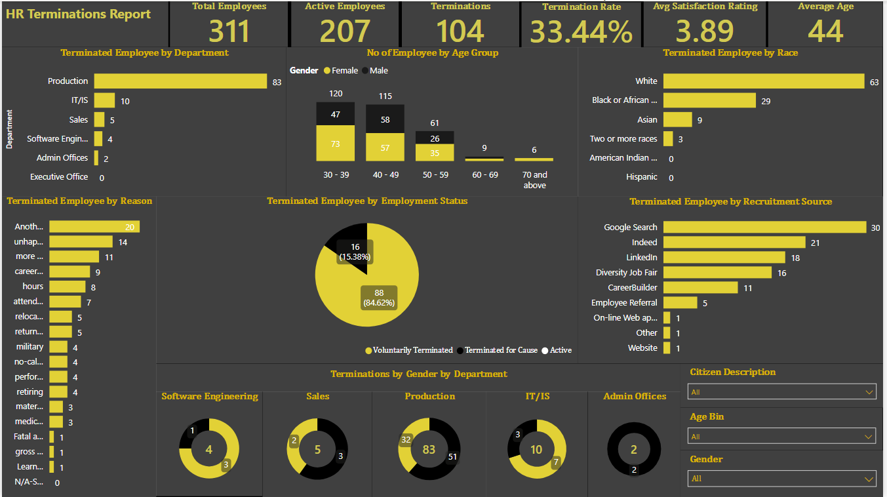

# HR Termination Analysis Using PowerBI

---

## Introduction
As part of the requirement to complete a Master Data Analyst certification programme at 10Alytics, I was presented with this Human Resource dataset from Legacy Group also known as Legacy Media and entertainment. It is an American media company formed in 2010. It is the owner of the largest commercial radio company in America. This is an in-depth and descriptive analysis of the Human Resources department within this company and it is aimed at empowering HR strategies with data driven insights to improve recruitment and retention in the company. This project was analyzed and visualized using PowerBI.

## Problem Statement
1.	What is the total number of employees?
2.	How many employees have been terminated?
3.	Calculated the age of employees from their date of birth
4.	Group employee age into 5 categories (30 - 39, 40 – 49, 50 – 59. 60 – 69. Over 70)
5.	What is the average employee satisfaction rate?
6.	What department has the highest termination rate?
7.	What is the split of terminated employee by gender?
8.	What is the split of terminated employee by recruitment source?
9.	What is the main reason for people terminating their contract?
10.	What is the split of terminated employee by department?

## Skills/Concept Demonstrated
The following features in Power BI was incorporated:
- Extract, Transform, Load
- Data Analysis Expression (DAX) concept: Calculated Column, Custom Columns, IF()

## Data Modelling 
No modelling was required as the dataset contained only one table.

## Data Transformation
I downloaded the dataset as a csv file from its source and imported it into PowerBI. I proceeded to do some transformation in power query before loading it into PowerBI. I added several conditional columns in power query and calculated the results of several fields using DAX expressions. I calculated the age from the date of birth by adding a new column and using the age option from the Date and Time Column Section, then grouped the age into bands using conditional column. I also added a conditional column to the table to determine the number of active employees by assigning a numeric value to the employment status of the employees. IF status is Active, Then 1, Else 0. Finally, I changed the datatype of all the columns that needs to be changed before closing and applying the steps to PowerBI. I then calculated the KPIs by creating measures in PowerBI which helps in the result of our analysis. Several charts and slicers were then used to design a dynamic and interactive dashboard which helped me to generate insight into the operation of the company.

## Visualization

## Insights
The following insights was drawn from the analysis:

- The company has a total number of 311 employees with 176 (56.59%) of the total workforce being female and 135 (43.41%) being male. 104 member of staff (60 females and 44 males) had been terminated due to a different number of reasons. The number of staff as at the time of writing this report is 207. The termination rate is 33.44% which is quite worrisome.
- The youngest employee is 30 while the oldest is 72. By Age group, the band with the highest number of employee are those aged between 30 - 39 followed by those aged 40 – 49 and it goes downhill from there. This goes to show that the company has a teeming number of agile and youthful workforce. The average age of employee is 44.
- The Production department is by far the largest department by the total number of employee. It has a total of 209 employees accounting for 67.20% of the entire workforce followed only by IT/IS department with 50 employees accounting for 16.08%. The executive office has the least number of employee, only 1 employee with a percentage total of 0.32%.
- Similarly, the department with the highest number of terminated employee is production which is also the department with the largest number of employee. Of a total of 104 terminations, production had 83 terminations which translated to a termination rate of 39.71%. No one has been terminated in the executive office up till now. By gender 51 females were terminated from production department while 32 were male.
- The top three recruitment source are Indeed (87 employees), Linkedln (76 employees) and Google Search (49 employees). It was discovered that employees recruited from Google search were the most terminated despite it being the third largest recruitment source. 30 employees out of 49 that were recruited through Google search had terminated their contract as at the time of writing this report. It was followed by Indeed with 21 terminations.
- The top 5 main reasons cited by employees terminating their contract are: first, because they got another job (20 employees). Second, they were unhappy (14 employees), third, they wanted more money (11 employees), fourth, they had a career change (9 employees) and fifth, the number of hours they put into work (8 employees).
- It is also worthy of note that 88 employees accounting for 84.62% of total terminated employees voluntarily terminated their appointments while only 16(16.38%) of the employees were terminated due to a cause.
- The average employee satisfaction rate is 3.48 out of 5. This shows that employees are fairly satisfied on their job.
  
## Recommendation
Based on the analysis above, it is recommended that HR department look closely into the issue of recruitment and retention. HR department needs to identify the channels that produced successful employees and use comprehensive hiring practices. The employees recruited from google search should be interviewed more thoroughly to determine their eligibility for the job before recruiting them. The reasons for employee leaving their jobs should be properly addressed too. This company must strive to create an environment where employees flourish and perform to the best of their abilities by providing adequate on-the-job training, practicing effective communication and offering benefits and perks which are a significant part of employee retention. Also, employees should be fairly compensated for the hours they put on the job and a proper work-life balance should be encouraged.

